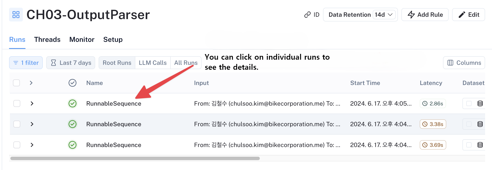
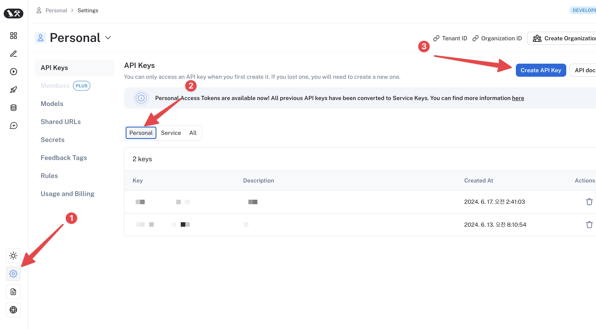
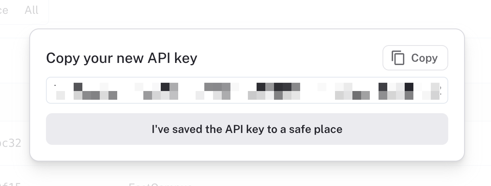

<style>
.custom {
    background-color: #008d8d;
    color: white;
    padding: 0.25em 0.5em 0.25em 0.5em;
    white-space: pre-wrap;       /* css-3 */
    white-space: -moz-pre-wrap;  /* Mozilla, since 1999 */
    white-space: -pre-wrap;      /* Opera 4-6 */
    white-space: -o-pre-wrap;    /* Opera 7 */
    word-wrap: break-word;
}

pre {
    background-color: #027c7c;
    padding-left: 0.5em;
}

</style>

# LangSmith Tracking Setup

- Author: [JeongGi Park](https://github.com/jeongkpa)
- Design: []()
- Peer Review: 
- This is a part of [LangChain Open Tutorial](https://github.com/LangChain-OpenTutorial/LangChain-OpenTutorial)

[](https://colab.research.google.com/github/LangChain-OpenTutorial/LangChain-OpenTutorial/blob/main/01-Basic/03-LangSmithTrackingSetup.ipynb) [](https://github.com/LangChain-OpenTutorial/LangChain-OpenTutorial/blob/main/01-Basic/03-LangSmithTrackingSetup.ipynb)

## Overview

This tutorial covers how to set up and use `LangSmith`, a powerful platform for developing, monitoring, and testing LLM applications. 
`LangSmith` provides comprehensive tracking capabilities that are essential for understanding and optimizing your LLM applications.

`LangSmith` tracking helps you monitor:

- Token usage and associated costs
- Execution time and performance metrics
- Error rates and unexpected behaviors
- Agent interactions and chain operations

In this tutorial, we'll walk through the process of setting up `LangSmith` tracking and integrating it with your `LangChain` applications.

### Table of Contents

- [Overview](#overview)
- [Setting up a LangSmith trace](#setting-up-a-langsmith-trace)
- [Using LangSmith tracking](#using-langsmith-tracking)
- [Enable tracking in your Jupyter notebook or code](#enable-tracking-in-your-jupyter-notebook-or-code)

### References

- [OpenAI API Pricing](https://openai.com/api/pricing/)
- [Token Usage Guide](https://help.openai.com/en/articles/4936856-what-are-tokens-and-how-to-count-them)
- [LangChain Python API Reference](https://python.langchain.com/api_reference/community/callbacks/langchain_community.callbacks.manager.get_openai_callback.html)
---

## Setting up a LangSmith trace

`LangSmith` is a platform for developing, monitoring, and testing LLM applications. 
If you're starting a project or learning `LangChain`, `LangSmith` is a must-have to get set up and running.

### Project-Level Tracking
At the project level, you can check execution counts, error rates, token usage, and billing information.


When you click on a project, all executed Runs appear.




### Detailed Step-by-Step Tracking for a Single Execution


After a single execution, it records not only the search results of retrieved documents but also detailed logs of GPT's input and output content. 
Therefore, it helps you determine whether to change the search algorithm or modify prompts after reviewing the searched content.


Moreover, at the top, it shows the time taken for a single Run (about 30 seconds) and tokens used (5,104), and when you hover over the tokens, it displays the billing amount.

## Using LangSmith tracking

Using traces is very simple.

### Get a LangSmith API Key


1. Go to https://smith.langchain.com/ and sign up.
2. After signing up, you will need to verify your email.
3. Click the left cog (Setting) - center "Personal" - "Create API Key" to get an API key.




Set environment variables is in the `.env` file.

Copy the contents of `.env_sample` and load it into your `.env` with the key you set.


```python
from dotenv import load_dotenv

load_dotenv(override=True)
```


<pre class="custom">True</pre>


In Description, enter a description that makes sense to you and click the Create API Key button.


Copy the generated key and proceed to the next step.

(Caution!) Copy the generated key somewhere safe so that it doesn't leak.




### Setting the LangSmith key in .env


First, enter the key you received from LangSmith and your project information in the .env file.

- `LANGCHAIN_TRACING_V2`: Set to "true" to start tracking.
- `LANGCHAIN_ENDPOINT`: https://api.smith.langchain.com (Do not modify this value).
- `LANGCHAIN_API_KEY`: Enter the key you received in the previous step.
- `LANGCHAIN_PROJECT`: Specify a project name to group and trace all runs under that project group.


## Enable tracking in your Jupyter notebook or code

Enabling tracking is very simple. All you need to do is set an environment variable.

Copy the contents of `.env_sample` and load it into your `.env` with the key you set

```python
%%capture --no-stderr
%pip install python-dotenv
```

```python
from dotenv import load_dotenv

load_dotenv(override=True)
```


<pre class="custom">True</pre>


As long as your traces are enabled and your API key and project name are set correctly, tracking will work properly.

However, if you want to change the project name or change the tracking, you can do so with the code below.

```python
import os

os.environ["LANGCHAIN_TRACING_V2"] = "true"
os.environ["LANGCHAIN_ENDPOINT"] = "https://api.smith.langchain.com"
os.environ["LANGCHAIN_PROJECT"] = "<LangChain Project Name>"
os.environ["LANGCHAIN_API_KEY"] = "<LangChain API KEY>"
```
